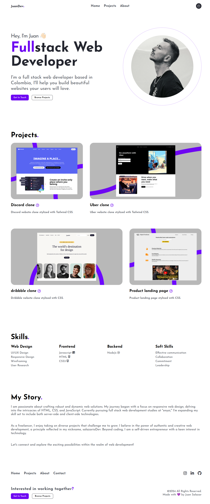

# Personal Portfolio
This repository hosts a **portfolio** created using **HTML** and **CSS**. The primary aim of this project is to showcase my expertise in front-end web development and to demonstrate the use of **GitHub Pages** for deploying and sharing projects.

**Click on the image if you want to view this project online.**

[](https://portfolio-enyoi.salazariodev.com/)

## Technologies
- HTML5 
- CSS3

## License
MIT License.

You can create your own personal Portfolio for free without notifying me by forking this project.

Check out [LICENSE](./LICENSE) for more detail.

## Installation

**1 - Clone this repo:**
```
git clone https://github.com/salazariodev/portfolio-enyoi.git
```

**2 - Go to project dir:**
```
cd portfolio-enyoi
```
**3 - Remove the `.git` folder, so you can add it to your own repo later:**

**Linux/MacOS**
```
rm -rf .git
```
**Windows**
Using PowerShell
```
Remove-Item .git -Recurse -Force
```


